# System Architecture & Layer Diagram Documentation
## Volunteering Expense & Revenue Reporting Tool

---

## 1. High-Level System Architecture

### 1.1 Three-Tier Architecture Overview

```
┌─────────────────────────────────────────────────────────┐
│                 PRESENTATION LAYER                      │
│              (React + Vite + PrimeReact)                │
│  • User Interface Components                            │
│  • Forms & Data Validation                              │
│  • Real-time Notifications                              │
│  • Context API State Management                         │
└────────────────────┬────────────────────────────────────┘
                     │ (HTTPS/Axios)
                     │ (Bearer Token Authentication)
                     ▼
┌─────────────────────────────────────────────────────────┐
│                  APPLICATION LAYER                      │
│                  (Laravel API)                          │
│  • REST API Endpoints                                   │
│  • Request Validation                                   │
│  • Business Logic (Services)                            │
│  • Authorization & Policy Checks                        │
│  • Data Transformation                                  │
└────────────────────┬────────────────────────────────────┘
                     │ (SQL Queries via Eloquent ORM)
                     ▼
┌─────────────────────────────────────────────────────────┐
│                  DATA LAYER                             │
│                 (SQLite/PostgreSQL)                     │
│  • Claims & Expenses                                    │
│  • User Management                                      │
│  • Role & Permission Management                         │
│  • Audit Trail & Notifications                          │
└─────────────────────────────────────────────────────────┘
```

---

## 2. Detailed System Architecture Diagram (Mermaid)

### 2.1 Complete System Flow

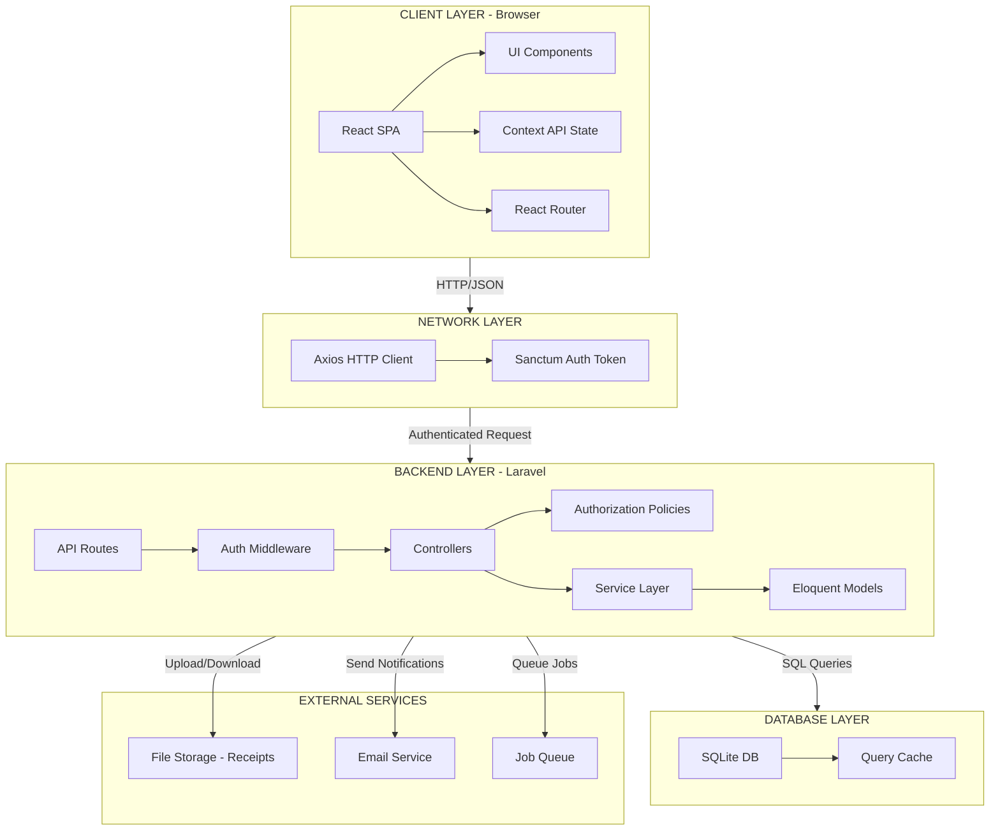

---

## 3. Component Architecture Diagram

### 3.1 Frontend Component Hierarchy

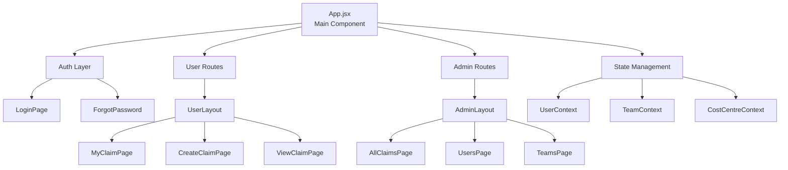

---

## 4. Backend Service Layer Architecture

### 4.1 Service & Controller Flow

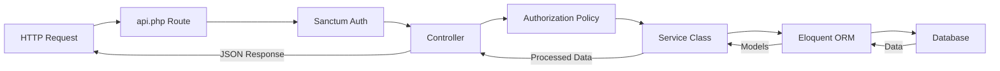

---

## 5. Data Flow: Creating a Claim

### 5.1 Complete User Journey - Claim Creation

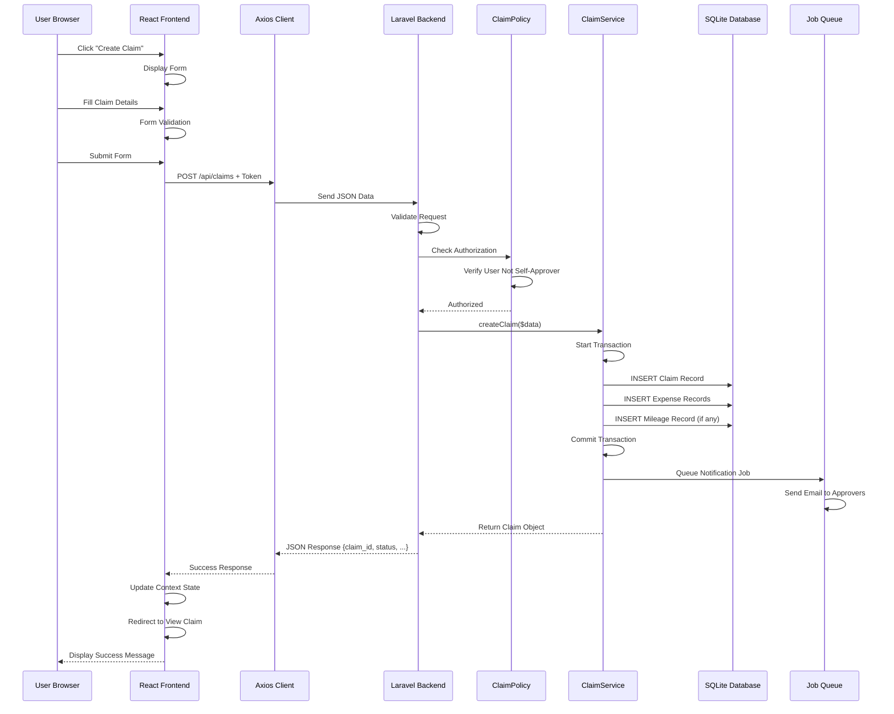

---

## 6. Data Flow: Approving a Claim

### 6.1 Claim Approval Workflow

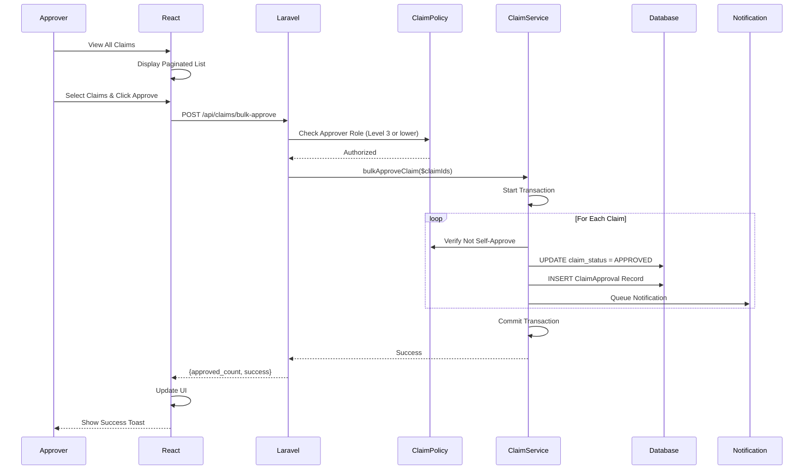

---

## 7. Database Schema Diagram

### 7.1 Entity Relationships

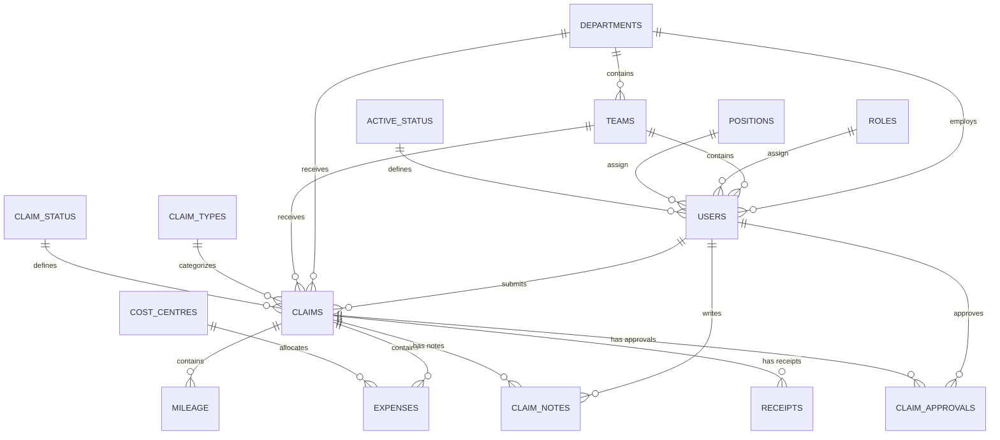

---

## 8. Authentication & Authorization Flow

### 8.1 Login Process

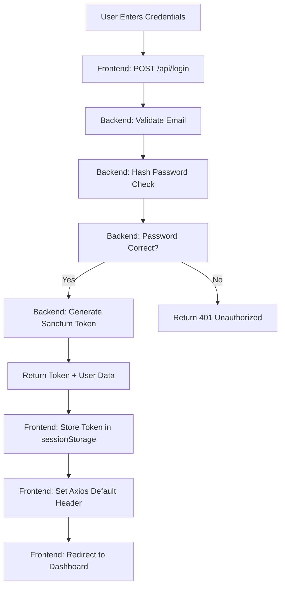

### 8.2 Authorization Levels (Role-Based Access Control)

```
Role Level 1 (Super Admin)
├── Can manage all users
├── Can manage all claims
├── Can bypass approval workflow
└── Can access all admin functions

Role Level 2 (Admin)
├── Can manage users in their department
├── Can view all claims in department
├── Can approve/reject claims
└── Can manage teams

Role Level 3 (Approver)
├── Can view claims in their team
├── Can approve/reject assigned claims
└── Can add notes to claims

Role Level 4 (Regular User)
├── Can submit claims
├── Can view own claims
├── Can track claim status
└── Can download receipts
```

---

## 9. API Communication Flow

### 9.1 Request/Response Cycle

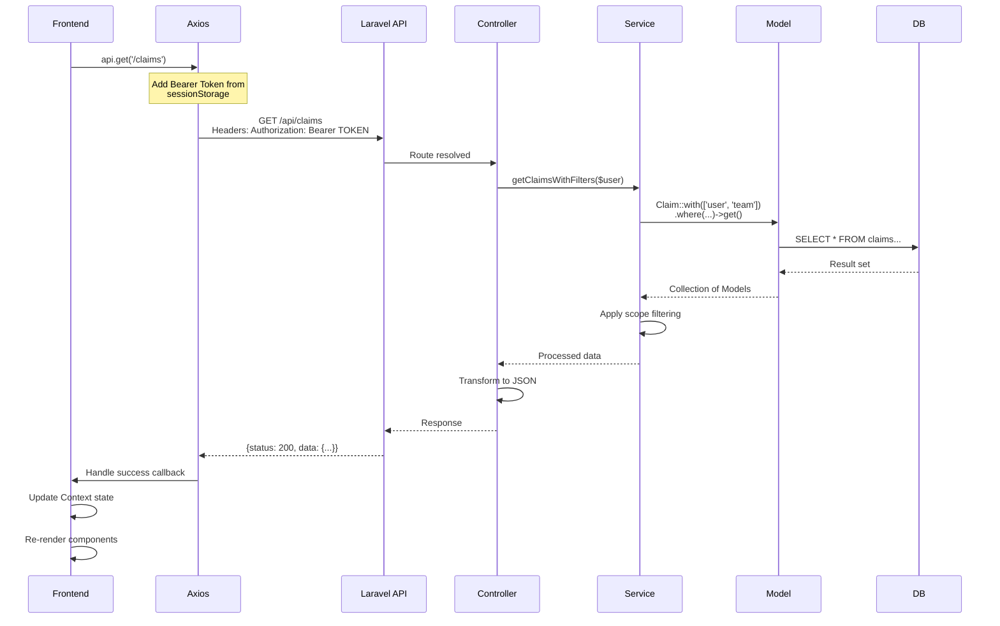

---

## 10. File Storage Architecture

### 10.1 Receipt Upload & Storage

```mermaid
graph LR
    A["Receipt File<br/>Selected by User"]
    B["Frontend Validation<br/>(Type, Size)"]
    C["FormData Creation"]
    D["POST /api/expenses<br/>with File"]
    E["Backend File Validation"]
    F["Store in<br/>storage/attachments/receipts/"]
    G["Record in<br/>RECEIPTS Table"]
    H["Return File Reference"]
    I["Frontend Display<br/>Thumbnail"]
    
    A --> B
    B --> C
    C --> D
    D --> E
    E --> F
    F --> G
    G --> H
    H --> I
```

---

## 11. Notification Architecture

### 11.1 Notification Flow

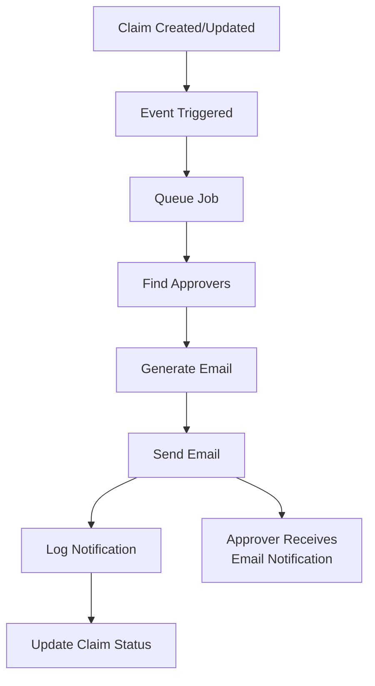

---

## 12. Error Handling & Validation Architecture

### 12.1 Validation Flow

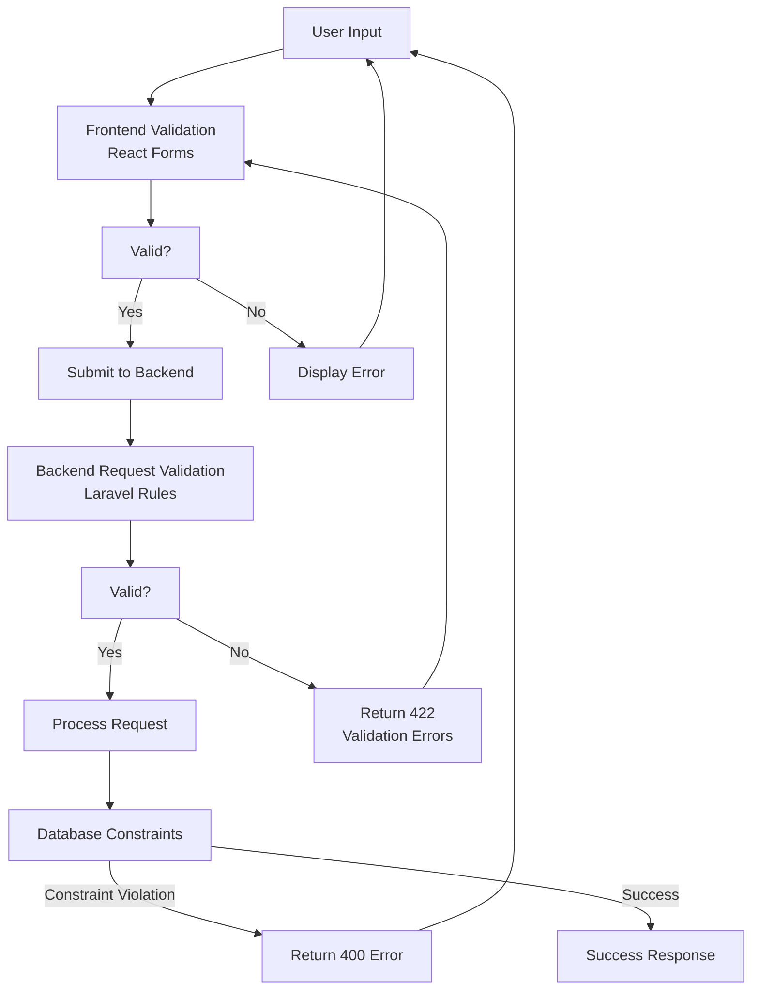

---

## 13. Scalability & Performance Architecture

### 13.1 Caching Strategy

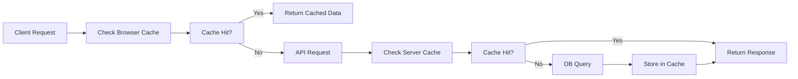

---

## 14. Deployment Architecture

### 14.1 Production Deployment Stack

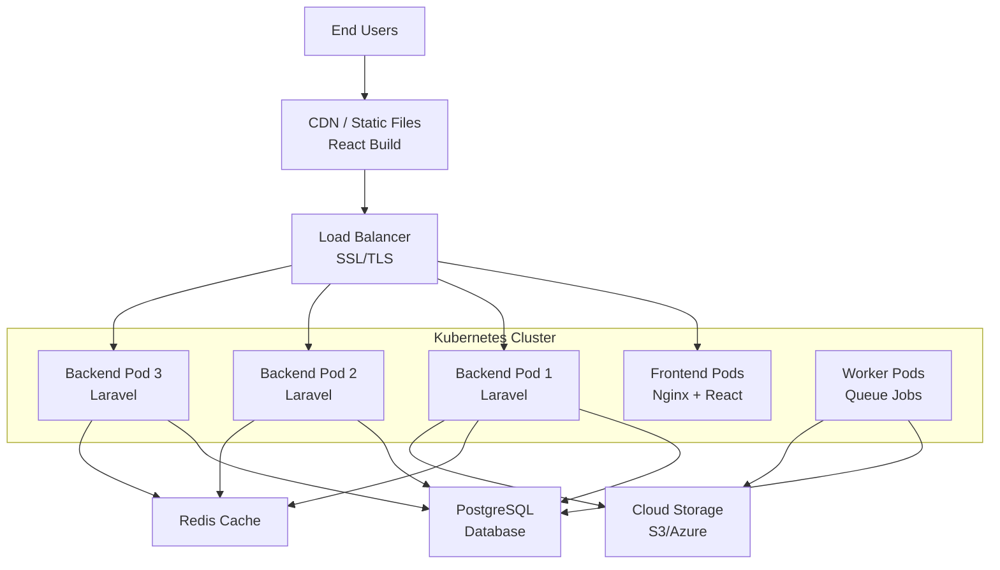

---

## 15. How to Generate These Diagrams

### 15.1 Using Mermaid (Recommended - Free & Easy)

**Option 1: GitHub Integration**
1. Copy Mermaid code blocks (marked with triple backticks and 'mermaid')
2. Paste into GitHub README or Issues - auto-renders!
3. No additional tools needed

**Option 2: Mermaid Live Editor**
1. Visit: https://mermaid.live
2. Paste the mermaid code
3. Click "Export" → Choose format (PNG, SVG, PDF)
4. Download and insert into PowerPoint

**Option 3: Mermaid VS Code Extension**
1. Install "Markdown Preview Mermaid Support" extension
2. Open any .md file with mermaid code
3. Preview renders live in editor
4. Take screenshots or export

### 15.2 Using PlantUML (Alternative)

1. Visit: https://www.plantuml.com/plantuml/uml/
2. Paste PlantUML syntax (can convert from Mermaid)
3. Generate PNG/SVG/PDF
4. Download and use

### 15.3 Using Draw.io (Manual but Powerful)

1. Visit: https://draw.io
2. Create new diagram
3. Manually draw boxes and connectors
4. Add labels and colors
5. Export as PNG/SVG/PDF
6. Insert into PowerPoint

### 15.4 Converting to PowerPoint

**Method 1: Direct Insertion**
1. Generate PNG/SVG from diagram tool
2. Open PowerPoint
3. Insert → Picture → Select your diagram
4. Resize and position on slide

**Method 2: Using Online Converter**
1. Export diagram as SVG
2. Upload to: https://cloudconvert.com (SVG to EMF)
3. This creates editable PowerPoint-ready format
4. Insert → Picture → EMF file

**Method 3: Copy-Paste from Web**
1. Generate diagram in Mermaid Live or similar
2. Right-click → Copy Image
3. Paste directly into PowerPoint slide

---

## 16. Recommended Diagram Creation Workflow for Presentations

### 16.1 For Quick Presentations

```
1. Use Mermaid Live Editor
   └─→ Copy code from this document
   └─→ Paste into editor
   └─→ Export as PNG
   └─→ Insert into PowerPoint

2. Total time: 5-10 minutes per diagram
```

### 16.2 For Professional Presentations

```
1. Use Draw.io or Lucidchart
   └─→ Recreate diagrams manually (more control)
   └─→ Add company branding/colors
   └─→ Export as high-resolution PNG
   └─→ Insert into PowerPoint template

2. Total time: 30-45 minutes per diagram (more polished)
```

### 16.3 For Interactive Presentations

```
1. Embed Mermaid diagrams in HTML
2. Use reveal.js or similar for presentation
3. Diagrams render live during presentation
4. Can dynamically explain flow
```

---

## 17. PowerPoint Slide Suggestions

### Slide 1: Title & Overview
```
Title: Volunteering Expense & Revenue Reporting Tool
Subtitle: System Architecture & Technical Overview
Image: System architecture diagram
```

### Slide 2: Technology Stack
```
- Frontend: React 18, Vite, Tailwind CSS, PrimeReact
- Backend: Laravel 12, PHP 8.2, Eloquent ORM
- Database: SQLite (dev), PostgreSQL (prod)
- Auth: Laravel Sanctum
- DevOps: Docker & Docker Compose
```

### Slide 3: Three-Tier Architecture
```
Diagram showing:
- Presentation Layer (React)
- Application Layer (Laravel API)
- Data Layer (Database)
```

### Slide 4: Component Hierarchy
```
Frontend component diagram
```

### Slide 5: Data Flow - Create Claim
```
Sequence diagram showing full claim creation flow
```

### Slide 6: Data Flow - Approve Claim
```
Sequence diagram showing approval workflow
```

### Slide 7: Authentication & RBAC
```
Auth flow diagram + role hierarchy
```

### Slide 8: API Architecture
```
REST API endpoints with HTTP methods
```

### Slide 9: Database Schema
```
Entity relationship diagram
```

### Slide 10: Deployment
```
Production deployment architecture (Kubernetes)
```

---

**Document Version:** 1.0  
**Last Updated:** January 2026  
**Diagrams Format:** Mermaid  
**Ready for:** PowerPoint Presentation
