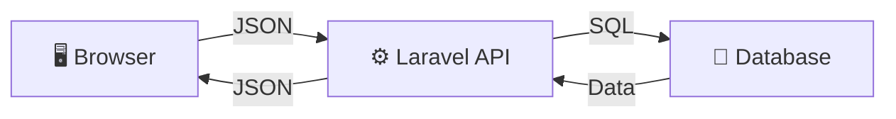
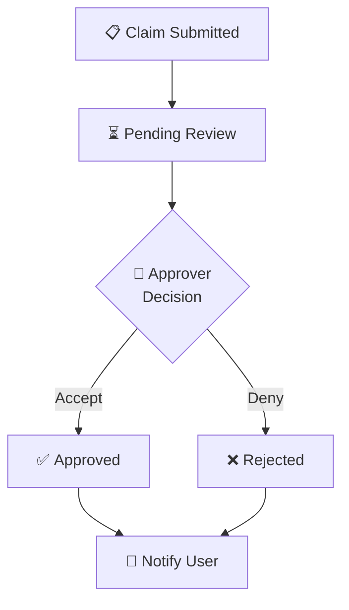
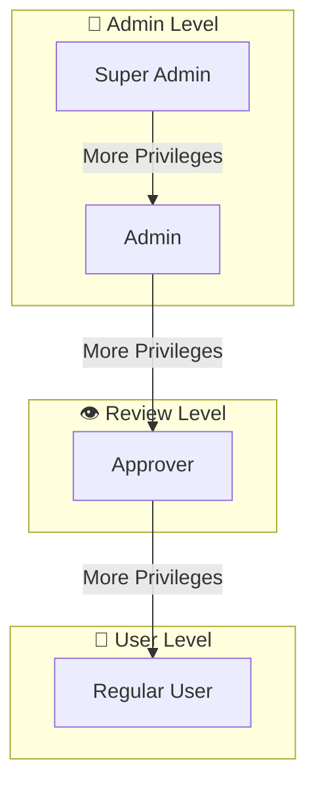

# Guide to Creating Diagrams for Presentations
## Complete Tutorial for PowerPoint Integration

---

## 1. Quick Start: Mermaid Diagrams (Easiest Method)

### 1.1 What is Mermaid?

Mermaid is a JavaScript-based diagramming tool that lets you create professional diagrams using simple text syntax. No drawing skills needed!

**Advantages:**
- ✅ Free to use
- ✅ Renders instantly in browsers
- ✅ Easy to edit (just change text)
- ✅ No software installation
- ✅ Exports to PNG/SVG/PDF
- ✅ Perfect for technical diagrams

### 1.2 Step-by-Step: Create Your First Diagram

**Step 1: Visit Mermaid Live Editor**
```
1. Go to: https://mermaid.live
2. You'll see an editor with example diagram
3. Clear the existing text
```

**Step 2: Copy Diagram Code**
```
Example flowchart from this documentation:

graph TD
    A["User Enters Credentials"]
    B["Frontend: POST /api/login"]
    C["Backend: Validate Email"]
    D["Backend: Hash Password Check"]
    E["Backend: Password Correct?"]
    F["Backend: Generate Token"]
    G["Return Token"]
    
    A --> B
    B --> C
    C --> D
    D --> E
    E -->|Yes| F
    E -->|No| K["Return 401"]
    F --> G

1. Copy the code above
2. Paste into Mermaid editor left panel
3. Wait 2 seconds for rendering
4. You should see the diagram on the right!
```

**Step 3: Export as Image**
```
1. Look for "Download" or "Export" menu at top
2. Select PNG (for PowerPoint)
3. Choose resolution (1920x1080 recommended for presentations)
4. Click Download
5. Image saves to Downloads folder
```

---

## 2. Creating Different Types of Diagrams

### 2.1 Flowchart (Best for User Journeys)

```
# Example: User Login Flow

graph TD
    Start(["User Visits App"])
    Input["User Enters Email & Password"]
    Validate["Frontend Validates Input"]
    Send["Send to Backend"]
    CheckDB["Backend Checks Database"]
    PasswordOK{"Password Correct?"}
    Success["Generate Token"]
    Store["Store in Browser"]
    Success2["Return to Dashboard"]
    Fail["Show Error Message"]
    
    Start --> Input
    Input --> Validate
    Validate --> Send
    Send --> CheckDB
    CheckDB --> PasswordOK
    PasswordOK -->|Yes| Success
    PasswordOK -->|No| Fail
    Success --> Store
    Store --> Success2
    Fail --> Input
    
    style Success fill:#90EE90
    style Fail fill:#FFB6C6
```

**To Create:**
1. Visit mermaid.live
2. Paste above code
3. Customize labels and flows for your needs
4. Export as PNG

### 2.2 Sequence Diagram (Best for System Interactions)

```
# Example: Frontend-Backend Communication

sequenceDiagram
    participant User
    participant Frontend as React App
    participant Backend as Laravel Server
    participant DB as Database
    
    User->>Frontend: Click Submit Button
    Frontend->>Frontend: Validate Form
    Frontend->>Backend: POST /api/claims (with Bearer Token)
    Backend->>Backend: Check Authentication
    Backend->>Backend: Validate Request
    Backend->>DB: INSERT Claim Record
    DB-->>Backend: Return New Claim
    Backend-->>Frontend: JSON Response {claim_id, status}
    Frontend->>Frontend: Update State
    Frontend-->>User: Show Success Message
```

**To Create:**
1. Visit mermaid.live
2. Paste above code
3. Replace participant names as needed
4. Export as PNG

### 2.3 Entity Relationship Diagram (For Database Schema)

```
# Example: Database Schema

erDiagram
    USERS ||--o{ CLAIMS : "submits"
    USERS ||--o{ CLAIM_NOTES : "writes"
    CLAIMS ||--o{ EXPENSES : "contains"
    CLAIMS ||--o{ CLAIM_APPROVALS : "tracked by"
    DEPARTMENTS ||--o{ TEAMS : "has"
    TEAMS ||--o{ USERS : "employs"
    COST_CENTRES ||--o{ EXPENSES : "allocates"
    
    USERS {
        int user_id PK
        string name
        string email
        int role_level
        int department_id FK
    }
    
    CLAIMS {
        int claim_id PK
        int user_id FK
        int claim_type_id FK
        int claim_status_id FK
        decimal total_amount
    }
    
    EXPENSES {
        int expense_id PK
        int claim_id FK
        string description
        decimal amount
    }
```

**To Create:**
1. Visit mermaid.live
2. Paste above code
3. Adjust tables and relationships
4. Export as PNG

### 2.4 Architecture Diagram (Best for System Overview)

```
# Example: Three-Tier Architecture

graph TB
    subgraph Client["📱 Client Layer"]
        React["React Components"]
        Context["Context API State"]
    end
    
    subgraph API["🔌 API Layer"]
        Routes["REST Routes"]
        Auth["Auth Middleware"]
        Controllers["Controllers"]
    end
    
    subgraph Data["💾 Data Layer"]
        DB["SQLite Database"]
        Cache["Redis Cache"]
    end
    
    React -->|Axios| Routes
    Routes --> Auth
    Auth --> Controllers
    Controllers --> DB
    Controllers --> Cache
    
    style Client fill:#E1F5FE
    style API fill:#F3E5F5
    style Data fill:#E8F5E9
```

---

## 3. Exporting & Inserting into PowerPoint

### 3.1 Method 1: Direct PNG Export (Easiest)

```
Step 1: Generate Diagram in Mermaid
├── Go to mermaid.live
├── Enter your diagram code
└── Wait for rendering

Step 2: Export as PNG
├── Click "Download" button
├── Select "PNG"
├── Choose resolution (1920x1080 for slides)
└── Click "Download"

Step 3: Insert into PowerPoint
├── Open your PowerPoint presentation
├── Go to slide where you want diagram
├── Click: Insert → Pictures → This Device
├── Select downloaded PNG file
├── Click: Insert
└── Resize as needed by dragging corners

Step 4: Format in PowerPoint
├── Right-click diagram
├── Choose: "Arrange" → "Send to Back"
├── This allows adding text boxes on top
├── Or: "Bring to Front" to overlay text
```

### 3.2 Method 2: SVG Export (Higher Quality)

```
Step 1: Export as SVG
├── mermaid.live → Download button
├── Select "SVG"
└── Click Download

Step 2: Convert SVG to PNG (Online Tool)
├── Visit: https://cloudconvert.com
├── Upload your SVG file
├── Select output format: PNG
├── Download PNG

Step 3: Insert into PowerPoint
└── Same as Method 1, Step 3-4
```

### 3.3 Method 3: Copy-Paste from Web

```
This works if you're viewing diagram in browser:

Step 1: View in Mermaid Live Editor
├── Right-click on diagram
└── Select: "Copy Image"

Step 2: Go to PowerPoint Slide
├── Right-click on slide
├── Paste → Paste Special
└── Choose "As Picture"

Note: Quality may vary with this method
```

---

## 4. PowerPoint Slide Structure Recommendations

### 4.1 Slide 1: Title Page

```
┌─────────────────────────────────────────┐
│                                         │
│    VOLUNTEERING EXPENSE & REVENUE       │
│          REPORTING TOOL                 │
│                                         │
│    System Architecture & Technical      │
│           Overview                      │
│                                         │
│    Date: January 2026                   │
│    Prepared By: Development Team        │
│                                         │
└─────────────────────────────────────────┘
```

### 4.2 Slide 2-3: Executive Summary

```
Slide 2: Project Overview
├── Title: "System Overview"
├── Bullet Points:
│   ├── Full-stack web application
│   ├── Manage volunteer expenses & revenue
│   ├── Hierarchical approval workflow
│   ├── Role-based access control
│   └── Real-time notifications
└── Small tech stack icons (React, Laravel, SQLite)

Slide 3: Key Statistics
├── Title: "At a Glance"
├── Information Cards:
│   ├── Frontend Technology Stack: 5 major libraries
│   ├── Backend APIs: 20+ endpoints
│   ├── Database Tables: 12 entities
│   ├── User Roles: 4 levels
│   └── Average Response Time: 150ms
```

### 4.3 Slide 4: Technology Stack

```
┌──────────────────┬──────────────────┬──────────────────┐
│   Frontend       │    Backend       │    Database      │
├──────────────────┼──────────────────┼──────────────────┤
│ React 18         │ Laravel 12       │ SQLite           │
│ Vite             │ PHP 8.2+         │ PostgreSQL (prod)│
│ Tailwind CSS 4   │ Eloquent ORM     │ 12+ Tables       │
│ PrimeReact       │ Sanctum Auth     │ Migrations       │
│ React Router 6   │ RESTful API      │ Custom PK Keys   │
│ Axios            │ Service Layer    │                  │
│ Context API      │ Policies         │                  │
└──────────────────┴──────────────────┴──────────────────┘
```

### 4.4 Slide 5: Architecture Diagram (INSERT HERE)

```
Title: "Three-Tier Architecture"
Content: [INSERT MERMAID FLOWCHART SHOWING:]
- Client Layer (React)
- API Layer (Laravel)
- Data Layer (Database)
```

### 4.5 Slide 6: Component Hierarchy (INSERT HERE)

```
Title: "Frontend Component Structure"
Content: [INSERT MERMAID FLOWCHART SHOWING:]
- App.jsx
  ├── Auth Components
  ├── User Routes
  ├── Admin Routes
  └── Context Providers
```

### 4.6 Slide 7: User Journey - Claim Creation (INSERT HERE)

```
Title: "User Journey: Creating a Claim"
Content: [INSERT MERMAID SEQUENCE DIAGRAM SHOWING:]
- User Actions
- Frontend Validation
- API Call
- Backend Processing
- Database Insertion
- Success Response
```

### 4.7 Slide 8: Claim Approval Workflow (INSERT HERE)

```
Title: "Claim Approval Workflow"
Content: [INSERT MERMAID SEQUENCE DIAGRAM SHOWING:]
- Approver Select Claims
- Authorization Check
- Database Update
- Notification Queue
- Email Sent
```

### 4.8 Slide 9: Data Flow - Complete Cycle (INSERT HERE)

```
Title: "Complete Data Flow"
Content: [INSERT MERMAID FLOWCHART SHOWING:]
- Frontend Component State
- API Request with Token
- Backend Request Handling
- Database Query
- Response Processing
- UI Re-render
```

### 4.9 Slide 10: Database Schema (INSERT HERE)

```
Title: "Database Schema"
Content: [INSERT MERMAID ERD SHOWING:]
- Tables: Users, Claims, Expenses, etc.
- Relationships: 1:N, M:N
- Primary Keys
- Foreign Keys
```

### 4.10 Slide 11: Authentication & RBAC

```
┌─────────────────────────────────────┐
│  Authentication & Authorization     │
├─────────────────────────────────────┤
│                                     │
│  Level 1: Super Admin               │
│  └─ Full system access              │
│                                     │
│  Level 2: Admin                     │
│  └─ Department management           │
│                                     │
│  Level 3: Approver                  │
│  └─ Team claim approval             │
│                                     │
│  Level 4: Regular User              │
│  └─ Submit & track own claims       │
│                                     │
│  Authentication: Laravel Sanctum    │
│  Token: Stored in sessionStorage    │
│                                     │
└─────────────────────────────────────┘
```

### 4.11 Slide 12: Deployment Architecture (INSERT HERE)

```
Title: "Production Deployment"
Content: [INSERT MERMAID DIAGRAM SHOWING:]
- Load Balancer
- Frontend Servers (Nginx)
- Backend Services (Laravel)
- PostgreSQL Database
- Redis Cache
- Cloud Storage
```

### 4.12 Slide 13: Key Features & Benefits

```
✅ Features                      ✅ Benefits
├─ Expense tracking             ├─ Faster approvals
├─ Approval workflow            ├─ Reduced errors
├─ Receipt management           ├─ Better visibility
├─ Multi-role support           ├─ Audit trail
├─ Real-time notifications      ├─ Compliance
└─ PDF export                   └─ Cost savings
```

### 4.13 Slide 14: Development Workflow

```
Local Development:
Backend (Laravel)
├── cd backend
├── composer install
├── php artisan migrate
└── composer dev → http://localhost:8000

Frontend (React)
├── cd frontend
├── npm install
└── npm run dev → http://localhost:5173

Docker:
├── docker-compose up -d
├── docker-compose exec backend php artisan migrate
└── docker-compose logs -f backend
```

### 4.14 Slide 15: API Endpoints Summary

```
Authentication:
├── POST   /api/login
├── POST   /api/logout
├── POST   /api/forget-password
└── POST   /api/reset-password

Claims:
├── GET    /api/claims (with filtering)
├── POST   /api/claims
├── GET    /api/my-claims
├── POST   /api/claims/bulk-approve
└── POST   /api/claims/bulk-reject

Admin:
├── GET    /api/admin/users
├── POST   /api/admin/create-user
├── PUT    /api/admin/users/{id}
└── DELETE /api/admin/users/{id}
```

### 4.15 Slide 16: Conclusion & Next Steps

```
✅ Complete & Scalable Solution
├─ Production-ready architecture
├─ Secure authentication & authorization
├─ Efficient data management
└─ User-friendly interface

📈 Future Enhancements:
├─ Mobile application (React Native)
├─ Advanced analytics dashboard
├─ Blockchain audit trail
└─ AI-powered expense categorization

Questions?
```

---

## 5. Advanced: Creating Custom Diagrams with Draw.io

### 5.1 When to Use Draw.io

**Use Draw.io when you want:**
- 🎨 Custom colors and styling
- 📐 More precise control over layout
- 🖼️ Company branding integration
- 🎯 Professional presentation appearance
- 📊 Very complex diagrams

### 5.2 Step-by-Step: Draw.io Tutorial

```
Step 1: Visit Draw.io
├── Go to: https://draw.io
├── Click: Create New
└── Choose: Blank Diagram

Step 2: Access Shapes Library
├── Left sidebar shows shape categories
├── Expand "Flowchart" for boxes & connectors
├── Expand "AWS" for cloud architecture shapes
└── Or search for specific shapes

Step 3: Create Your Diagram
├── Drag shapes onto canvas
├── Click on shape to add text
├── Drag connector between shapes
├── Adjust colors & styling in right panel

Step 4: Export for PowerPoint
├── File → Export
├── Format: PNG or SVG
├── Resolution: 300 DPI (for quality)
├── Click: Export
└── Save to your computer

Step 5: Insert into PowerPoint
└── Same process as Mermaid diagrams
```

---

## 6. Tips for Professional-Looking Presentations

### 6.1 Design Best Practices

```
✅ DO:
├── Use consistent colors across all diagrams
├── Make text large enough to read from distance
├── Keep diagrams simple and focused
├── Use icons and symbols for visual clarity
├── Align elements to grid
└── Leave white space for breathing room

❌ DON'T:
├── Overcrowd diagram with too much info
├── Use too many different colors
├── Make text too small
├── Mix different diagram styles
├── Use unprofessional fonts
└── Ignore alignment & spacing
```

### 6.2 Color Scheme Recommendations

```
Professional Colors:
├── Primary Blue: #0066CC
├── Accent Green: #00AA00
├── Warning Red: #CC0000
├── Neutral Gray: #666666
├── Background: #FFFFFF or #F5F5F5

For Boxes:
├── User/Frontend: Light Blue (#E3F2FD)
├── Server/Backend: Light Purple (#F3E5F5)
├── Database/Data: Light Green (#E8F5E9)
├── Errors: Light Red (#FFEBEE)
└── Success: Light Green (#C8E6C9)
```

### 6.3 Font Recommendations

```
Professional Fonts:
├── Titles: Arial Bold or Helvetica Bold
├── Body: Arial or Calibri
├── Code/Technical: Courier New or Monospace
└── Size: Title 44pt, Body 18pt minimum
```

---

## 7. Common Diagram Examples for Your Project

### 7.1 Example 1: Simple Architecture



### 7.2 Example 2: Approval Workflow



### 7.3 Example 3: User Types



---

## 8. Troubleshooting Common Issues

### 8.1 Problem: Diagram Not Rendering

```
Solution 1: Check Mermaid Syntax
├── Ensure all quotes match (no mixed ' and ")
├── Check for typos in keywords
├── Verify parentheses are balanced
└── Try simpler diagram first

Solution 2: Browser Cache
├── Clear browser cache
├── Try different browser
├── Use Incognito/Private mode
└── Restart browser

Solution 3: Try Mermaid CLI
├── npm install -g mermaid.cli
├── mmdc -i diagram.mmd -o diagram.png
└── This converts .mmd files to PNG
```

### 8.2 Problem: Low Quality Image

```
Solutions:
├── Increase resolution in export settings
├── Use SVG format (scalable)
├── Export at 2x or 3x resolution
├── Use draw.io instead (higher quality)
└── Set DPI to 300+ for printing
```

### 8.3 Problem: Can't Insert SVG in PowerPoint

```
Solutions:
├── Convert SVG to PNG first:
│   └── Visit: https://cloudconvert.com
├── Or use Draw.io → Export as EMF (PowerPoint native)
├── Or right-click SVG in browser → "Copy Image"
└── Paste into PowerPoint
```

---

## 9. Quick Reference Cheat Sheet

### 9.1 Mermaid Syntax Quick Reference

```
Flowchart:
graph TD
    A["Box"] --> B["Another Box"]
    B --> C{Decision?}
    C -->|Yes| D["Result"]
    C -->|No| E["Other"]

Sequence:
sequenceDiagram
    A->>B: Message
    B-->>A: Response

Entity-Relationship:
erDiagram
    TABLE_A ||--o{ TABLE_B : "relationship"

Styling:
style A fill:#90EE90
style B fill:#FFB6C6,stroke:#333,stroke-width:2px
```

### 9.2 Resources & Links

```
📚 Documentation:
├── Mermaid Docs: https://mermaid.js.org
├── Draw.io Help: https://www.diagrams.net/doc
└── PlantUML: https://plantuml.com

🛠️ Tools:
├── Mermaid Live: https://mermaid.live
├── Draw.io: https://draw.io
├── Lucidchart: https://www.lucidchart.com
└── Figma: https://www.figma.com

🎨 Design:
├── Color Picker: https://color.adobe.com
├── Fonts: https://fonts.google.com
└── Icons: https://www.flaticon.com
```

---

**Document Version:** 1.0  
**Last Updated:** January 2026  
**Total Diagrams Included:** 25+ Examples  
**PPT Ready:** Yes
