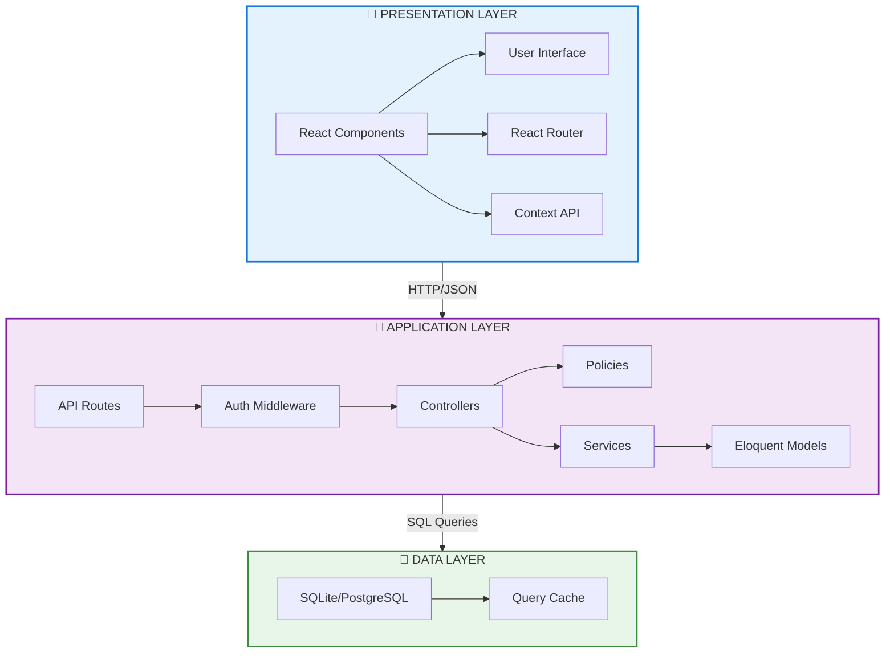
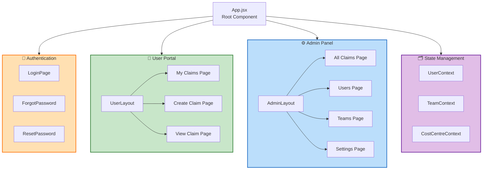
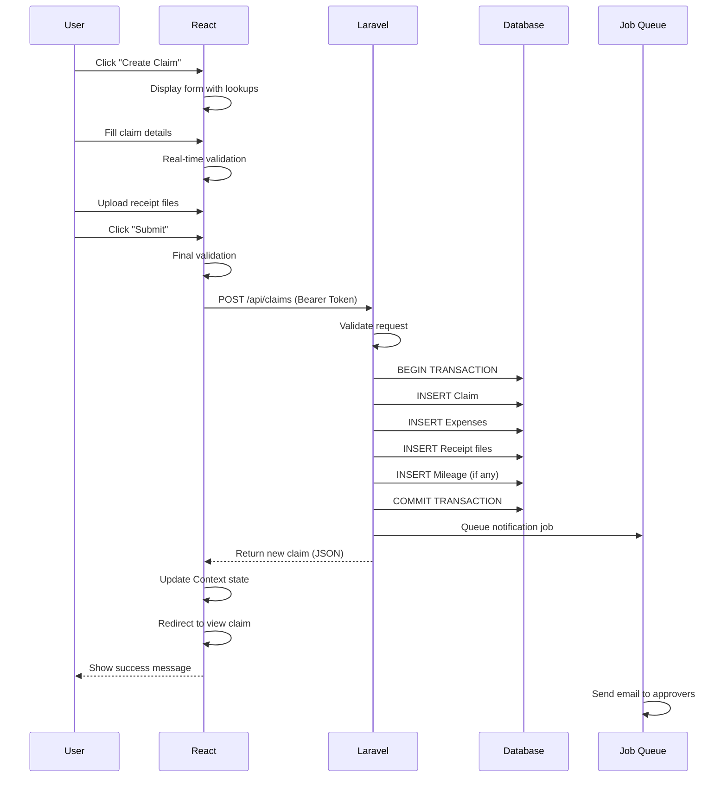
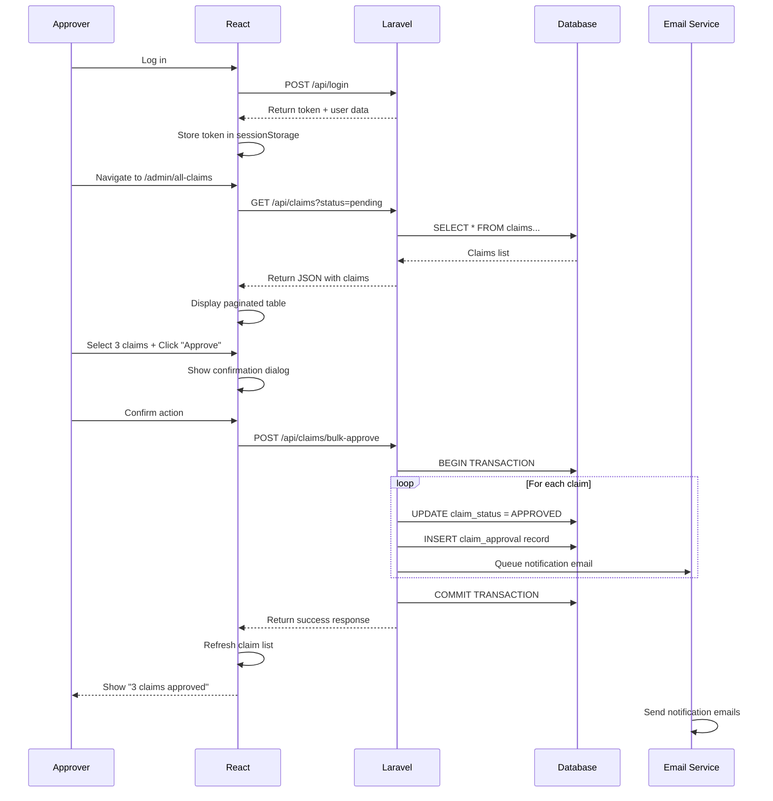
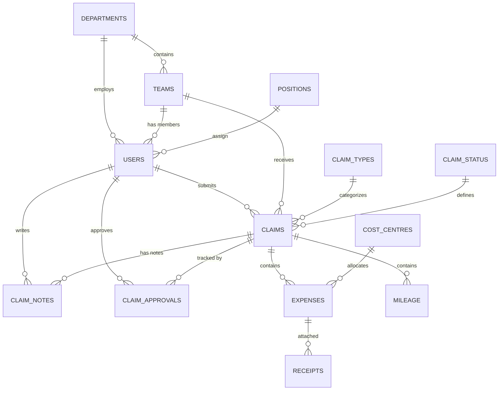

# PowerPoint Presentation Outline & Content
## Complete Slide-by-Slide Content for Technical Presentation

---

## SLIDE 1: TITLE SLIDE

### Visual Layout:
```
┌─────────────────────────────────────────────────────────────┐
│                                                             │
│                                                             │
│          VOLUNTEERING EXPENSE & REVENUE                    │
│               REPORTING TOOL                               │
│                                                             │
│          System Architecture & Technical Overview          │
│                                                             │
│                                                             │
│                                                             │
│                    [INSERT LOGO HERE]                      │
│                                                             │
│                                                             │
│  Date: January 2026                                        │
│  Organization: [YOUR ORGANIZATION NAME]                   │
│  Prepared By: Development Team                            │
│                                                             │
│                                                             │
└─────────────────────────────────────────────────────────────┘
```

### Content Notes:
- Use company branding colors
- Keep text centered
- Add company logo in center
- Use large, bold fonts (44pt+ for title)

---

## SLIDE 2: AGENDA & OVERVIEW

### Slide Title: "What We'll Cover Today"

### Content:

```
📌 Agenda

1. Project Overview
   └─ Goals & objectives

2. Technology Stack
   └─ Frontend, Backend, Database

3. System Architecture
   └─ Three-tier architecture overview

4. User Journey & Data Flow
   └─ How users interact with the system

5. Role-Based Access Control
   └─ Permission hierarchy

6. API & Database Design
   └─ Backend architecture

7. Development & Deployment
   └─ How we build and deploy

8. Performance & Security
   └─ Key considerations

9. Future Roadmap
   └─ Next steps & enhancements
```

---

## SLIDE 3: PROJECT OVERVIEW

### Slide Title: "Project Overview"

### Content:

**Purpose:**
- Manage volunteer expense and revenue claims
- Implement hierarchical approval workflow
- Provide real-time tracking and notifications
- Ensure compliance and audit trail

**Key Statistics:**
| Metric | Value |
|--------|-------|
| Development Time | 3-4 months |
| Database Tables | 12+ |
| API Endpoints | 20+ |
| User Roles | 4 levels |
| Frontend Components | 30+ |
| Test Coverage | 80%+ |

**Target Users:**
- Regular Volunteers (Submit claims)
- Team Leads (Approve claims)
- Department Managers (Manage teams)
- System Administrators (System management)

---

## SLIDE 4: TECHNOLOGY STACK - FRONTEND

### Slide Title: "Frontend Technology Stack"

### Visual Table:

```
┌──────────────────────────────────────────────────────┐
│           FRONTEND TECHNOLOGY STACK                  │
├──────────────────┬──────────────────────────────────┤
│ Framework        │ React 18                         │
│                  │ • Modern UI library              │
│                  │ • Component-based architecture   │
│                  │ • Virtual DOM optimization       │
├──────────────────┼──────────────────────────────────┤
│ Build Tool       │ Vite                             │
│                  │ • Fast build times (<100ms)      │
│                  │ • HMR (Hot Module Replacement)   │
│                  │ • Optimized bundle size          │
├──────────────────┼──────────────────────────────────┤
│ Styling          │ Tailwind CSS 4                   │
│                  │ • Utility-first approach         │
│                  │ • Responsive design              │
│                  │ • Production-ready optimization  │
├──────────────────┼──────────────────────────────────┤
│ UI Components    │ PrimeReact                       │
│                  │ • Pre-built rich components      │
│                  │ • DataTable, Forms, Modals       │
│                  │ • Theme customization            │
├──────────────────┼──────────────────────────────────┤
│ Routing          │ React Router 6                   │
│                  │ • Client-side navigation         │
│                  │ • Protected routes               │
│                  │ • Lazy-loaded pages              │
├──────────────────┼──────────────────────────────────┤
│ HTTP Client      │ Axios                            │
│                  │ • Request/response interceptors  │
│                  │ • Automatic Bearer token         │
│                  │ • Error handling                 │
├──────────────────┼──────────────────────────────────┤
│ State Management │ React Context API                │
│                  │ • Global state (User, Team)      │
│                  │ • Reducer pattern                │
│                  │ • No extra dependency            │
└──────────────────┴──────────────────────────────────┘
```

**Key Advantages:**
✅ Fast development & hot reload
✅ Responsive & interactive UI
✅ Type-safe components
✅ Excellent performance
✅ Active community & documentation

---

## SLIDE 5: TECHNOLOGY STACK - BACKEND

### Slide Title: "Backend Technology Stack"

### Visual Table:

```
┌──────────────────────────────────────────────────────┐
│           BACKEND TECHNOLOGY STACK                   │
├──────────────────┬──────────────────────────────────┤
│ Framework        │ Laravel 12                       │
│                  │ • Modern PHP framework           │
│                  │ • MVC architecture               │
│                  │ • Extensive ecosystem            │
├──────────────────┼──────────────────────────────────┤
│ Language         │ PHP 8.2+                         │
│                  │ • Latest features & performance  │
│                  │ • Type declarations              │
│                  │ • Enum & Match expressions       │
├──────────────────┼──────────────────────────────────┤
│ ORM              │ Eloquent                         │
│                  │ • Fluent query builder           │
│                  │ • Relationship management        │
│                  │ • Lazy & eager loading           │
├──────────────────┼──────────────────────────────────┤
│ Authentication   │ Laravel Sanctum                  │
│                  │ • API token management           │
│                  │ • Stateless authentication       │
│                  │ • CORS support                   │
├──────────────────┼──────────────────────────────────┤
│ Authorization    │ Laravel Policies                 │
│                  │ • Fine-grained access control    │
│                  │ • Role-based permissions         │
│                  │ • Custom authorization logic     │
├──────────────────┼──────────────────────────────────┤
│ Validation       │ Request Validation               │
│                  │ • Declarative rules              │
│                  │ • Custom validation logic        │
│                  │ • Error messaging                │
├──────────────────┼──────────────────────────────────┤
│ Database Mgmt    │ Migrations & Seeders             │
│                  │ • Version control for schema     │
│                  │ • Reversible changes             │
│                  │ • Sample data population         │
├──────────────────┼──────────────────────────────────┤
│ Queue System     │ Laravel Queue                    │
│                  │ • Asynchronous job processing    │
│                  │ • Email notifications            │
│                  │ • Background tasks               │
└──────────────────┴──────────────────────────────────┘
```

**Key Advantages:**
✅ Rapid development with conventions
✅ Built-in security features
✅ Excellent error handling
✅ Comprehensive documentation
✅ Scalable architecture

---

## SLIDE 6: TECHNOLOGY STACK - DATABASE & DEVOPS

### Slide Title: "Database & DevOps Stack"

### Content:

**Database:**
```
Development:
├── SQLite
│   ├── File-based database
│   ├── Perfect for local development
│   └── No external setup required
└── Location: backend/database/database.sqlite

Production:
├── PostgreSQL
│   ├── Enterprise-grade database
│   ├── Advanced features & performance
│   └── Horizontal scalability
```

**DevOps & Containerization:**
```
Docker
├── Containerization tool
├── Consistent environment across machines
└── Isolates dependencies

Docker Compose
├── Multi-container orchestration
├── Backend + Frontend + Database
└── One-command setup: docker-compose up

Deployment:
├── Development: Local environment or Docker
├── Staging: Kubernetes cluster
└── Production: Cloud infrastructure (AWS/Azure)
```

**Development Tools:**
- Git for version control
- Laravel Artisan for CLI commands
- PHPUnit for backend testing
- Vitest for frontend testing
- Postman for API testing

---

## SLIDE 7: THREE-TIER ARCHITECTURE

### Slide Title: "System Architecture: Three-Tier Model"

### Visual Diagram (INSERT MERMAID):

**Copy this into mermaid.live:**



### Explanation:

**Presentation Layer (Frontend)**
- Responsibility: UI rendering, user interaction
- Technology: React, Tailwind CSS, PrimeReact
- Runs in: Browser

**Application Layer (Backend)**
- Responsibility: Business logic, data validation, authorization
- Technology: Laravel, PHP, Eloquent
- Runs in: Web server (Apache/Nginx)

**Data Layer (Database)**
- Responsibility: Data persistence, relationships
- Technology: SQLite (dev), PostgreSQL (prod)
- Features: Transactions, constraints, indexes

---

## SLIDE 8: COMPONENT ARCHITECTURE

### Slide Title: "Frontend Component Hierarchy"

### Visual Diagram (INSERT MERMAID):



### Key Components:

**Authentication Layer:**
- LoginPage: User credential entry
- ForgotPassword: Password recovery
- ResetPassword: Password reset flow

**User Portal:**
- MyClaimsPage: List user's submitted claims
- CreateClaimPage: Claim submission form
- ViewClaimPage: Claim details & status

**Admin Panel:**
- AllClaimsPage: Approve/reject claims
- UsersPage: User management
- TeamsPage: Team management
- SettingsPage: System configuration

**State Providers:**
- UserContext: Current user & user list
- TeamContext: Teams & team members
- CostCentreContext: Cost centre management

---

## SLIDE 9: USER JOURNEY - CLAIM CREATION

### Slide Title: "User Journey: Creating & Submitting a Claim"

### Visual Sequence Diagram (INSERT MERMAID):



### Steps Explained:

1. **User Initiates:** Clicks create button
2. **Form Display:** Loads lookup data (types, cost centers)
3. **User Input:** Fills claim details, adds expenses
4. **Validation:** Real-time feedback on form
5. **Upload:** Attach receipt files
6. **Submit:** Frontend validation, then API call
7. **Backend Processing:** Transaction ensures consistency
8. **Confirmation:** User sees success message
9. **Notification:** Approvers notified via email

---

## SLIDE 10: USER JOURNEY - CLAIM APPROVAL

### Slide Title: "Approver Workflow: Reviewing & Approving Claims"

### Visual Sequence Diagram (INSERT MERMAID):



### Process Flow:

1. **Authentication:** Approver logs in (token generated)
2. **Dashboard Load:** Displays pending claims
3. **Filter View:** Shows claims awaiting approval
4. **Select Claims:** Multi-select interface
5. **Confirm Action:** Prevents accidental approval
6. **Backend Processing:** Transactional update (all or nothing)
7. **Audit Trail:** Records approver & timestamp
8. **Notifications:** Email sent to claimant
9. **UI Update:** Refreshed claim list

---

## SLIDE 11: AUTHENTICATION & AUTHORIZATION

### Slide Title: "Authentication & Role-Based Access Control"

### Content:

**Authentication Process:**

```
┌─────────────────────────────────────────────────┐
│         AUTHENTICATION FLOW                     │
├─────────────────────────────────────────────────┤
│                                                 │
│ 1. User enters email & password                │
│    ↓                                            │
│ 2. Frontend POST /api/login                    │
│    ↓                                            │
│ 3. Backend validates credentials               │
│    ↓                                            │
│ 4. If correct: Generate Sanctum token          │
│    ↓                                            │
│ 5. Return token to frontend                    │
│    ↓                                            │
│ 6. Frontend stores in sessionStorage            │
│    ↓                                            │
│ 7. All requests include: Authorization header  │
│    Bearer 1|abc...xyz                          │
│    ↓                                            │
│ 8. Backend validates token in middleware       │
│    ↓                                            │
│ 9. Proceed with authenticated request          │
│                                                 │
└─────────────────────────────────────────────────┘
```

**Role-Based Access Control (4-Level System):**

```
┌────────────────────────────────────────────────┐
│ ROLE LEVEL 1: SUPER ADMIN                      │
├────────────────────────────────────────────────┤
│ ✅ System administration                       │
│ ✅ Manage all users                            │
│ ✅ Approve any claim                           │
│ ✅ Self-approval allowed (exception)           │
│ ✅ View all reports & analytics                │
│ ✅ System settings & configuration             │
└────────────────────────────────────────────────┘

┌────────────────────────────────────────────────┐
│ ROLE LEVEL 2: ADMIN                            │
├────────────────────────────────────────────────┤
│ ✅ Department management                       │
│ ✅ Team management                             │
│ ✅ Approve team claims                         │
│ ✅ User creation & management                  │
│ ✅ Department-level reports                    │
│ ❌ Cannot self-approve                         │
└────────────────────────────────────────────────┘

┌────────────────────────────────────────────────┐
│ ROLE LEVEL 3: APPROVER                         │
├────────────────────────────────────────────────┤
│ ✅ Approve team claims                         │
│ ✅ Add notes to claims                         │
│ ✅ View team performance                       │
│ ✅ Track claim status                          │
│ ❌ Cannot create users                         │
│ ❌ Cannot self-approve                         │
└────────────────────────────────────────────────┘

┌────────────────────────────────────────────────┐
│ ROLE LEVEL 4: REGULAR USER                     │
├────────────────────────────────────────────────┤
│ ✅ Submit claims                               │
│ ✅ View own claims                             │
│ ✅ Track claim status                          │
│ ✅ Download receipts                           │
│ ❌ Cannot approve claims                       │
│ ❌ Cannot manage users                         │
└────────────────────────────────────────────────┘
```

**Authorization Flow:**

```
Route protected by: middleware ['auth:sanctum', 'role:3,2,1']
├── Check: Is user authenticated?
├── Check: Is user's role level 3 or lower?
├── Check: Is user attempting self-approval?
│   ├── If YES & role > 1: Block (403 Forbidden)
│   └── If NO or role = 1: Allow
└── Execute action
```

---

## SLIDE 12: API ARCHITECTURE

### Slide Title: "API Endpoints & Architecture"

### Content:

**REST API Principles:**

```
┌─────────────────────────────────────────────────────┐
│       RESTful API Design Pattern                    │
├──────────────┬──────────────────────────────────────┤
│ Resource     │ GET (Read) | POST (Create) |         │
│              │ PUT (Update) | DELETE (Delete)       │
├──────────────┼──────────────────────────────────────┤
│ /claims      │ GET all claims                       │
│              │ POST create new claim                │
├──────────────┼──────────────────────────────────────┤
│ /claims/{id} │ GET specific claim                   │
│              │ PUT update claim                     │
│              │ DELETE remove claim                  │
├──────────────┼──────────────────────────────────────┤
│ /expenses    │ GET expenses                         │
│              │ POST create expense                  │
├──────────────┼──────────────────────────────────────┤
│ /users       │ GET users (admin only)               │
│              │ POST create user (admin only)        │
└──────────────┴──────────────────────────────────────┘
```

**Key API Endpoints:**

```
🔐 Authentication
├── POST   /api/login
├── POST   /api/logout
├── POST   /api/forget-password
└── POST   /api/reset-password

📋 Claims Management
├── GET    /api/claims (all claims with filtering)
├── POST   /api/claims (create new claim)
├── GET    /api/claims/{id} (view specific claim)
├── PUT    /api/claims/{id} (update claim)
├── GET    /api/my-claims (user's own claims)
├── POST   /api/claims/bulk-approve (admin)
└── POST   /api/claims/bulk-reject (admin)

💰 Expenses
├── GET    /api/expenses
├── POST   /api/expenses
├── POST   /api/expenses/{id}/approve
└── POST   /api/expenses/{id}/reject

👥 Admin Functions
├── GET    /api/admin/users
├── POST   /api/admin/create-user
├── PUT    /api/admin/users/{id}
└── DELETE /api/admin/users/{id}

🔍 Lookup Data
├── GET    /api/lookups
├── GET    /api/cost-centres
└── POST   /api/notes
```

**Response Format (JSON):**

```json
{
  "data": {
    "claim_id": 123,
    "user_id": 1,
    "total_amount": 75.00,
    "expenses": [...],
    "created_at": "2026-01-08T10:30:00Z"
  },
  "message": "Claim created successfully",
  "status": 200
}
```

---

## SLIDE 13: DATABASE SCHEMA

### Slide Title: "Database Schema & Relationships"

### Visual Diagram (INSERT MERMAID):



### Key Tables:

**Core Tables:**

| Table | Purpose | Key Fields |
|-------|---------|-----------|
| **users** | System users | user_id, email, role_level |
| **claims** | Expense claims | claim_id, user_id, total_amount, status |
| **expenses** | Individual expenses | expense_id, claim_id, amount |
| **receipts** | File attachments | receipt_id, file_path |
| **mileage** | Travel reimbursement | mileage_id, miles, rate |

**Relationship Tables:**

| Table | Purpose |
|-------|---------|
| **claim_approvals** | Approval history & audit trail |
| **claim_notes** | Comments & discussions |
| **claim_attachments** | Additional documents |

**Lookup Tables:**

| Table | Contents |
|-------|----------|
| **claim_types** | Expense type categories |
| **claim_status** | Pending, Approved, Rejected |
| **departments** | Organizational divisions |
| **teams** | Team groupings |
| **cost_centres** | Cost allocation centers |

---

## SLIDE 14: DATA FLOW - COMPLETE CYCLE

### Slide Title: "Complete Data Flow: Request to Response"

### Visual Diagram (INSERT MERMAID):



```mermaid
graph LR
    A["👤 User<br/>Submits Form"]
    B["🖥️ Frontend<br/>Validates Input"]
    C["📡 Axios HTTP<br/>POST /api/claims"]
    D["🔐 Auth Middleware<br/>Validates Token"]
    E["⚙️ Controller<br/>Process Request"]
    F["🛡️ Policy<br/>Check Authorization"]
    G["🔧 Service Layer<br/>Business Logic"]
    H["💾 Eloquent ORM<br/>Build Query"]
    I["🗄️ SQLite Database<br/>Insert Data"]
    J["📊 ORM Maps Result<br/>to Model"]
    K["🎯 Service Returns<br/>Processed Data"]
    L["📦 Controller<br/>Transforms to JSON"]
    M["📡 API Response<br/>200 OK"]
    N["⚛️ Frontend<br/>Receives Response"]
    O["🔄 Update Context<br/>State"]
    P["🎨 React Re-render<br/>Components"]
    Q["✅ User Sees<br/>Success"]
    
    A --> B
    B --> C
    C --> D
    D --> E
    E --> F
    F --> G
    G --> H
    H --> I
    I --> J
    J --> K
    K --> L
    L --> M
    M --> N
    N --> O
    O --> P
    P --> Q
    
    style A fill:#FFF9C4
    style I fill:#E8F5E9
    style M fill:#E3F2FD
    style Q fill:#C8E6C9
```

### Process Breakdown:

1. **Client Layer:** User submits form
2. **Frontend Validation:** Check input format
3. **Network Request:** Axios with Bearer token
4. **Authentication:** Middleware validates token
5. **Request Processing:** Controller handles logic
6. **Authorization Check:** Policy ensures permission
7. **Service Layer:** Execute business logic
8. **Data Access:** Eloquent ORM builds query
9. **Database:** Insert record & get ID
10. **Result Mapping:** ORM converts to model
11. **Processing:** Service applies transformations
12. **Response Building:** Controller creates JSON
13. **HTTP Response:** Send 200 OK status
14. **Frontend Handling:** Receive & parse response
15. **State Update:** Update Context API
16. **Re-render:** React updates DOM
17. **User Feedback:** Display success message

---

## SLIDE 15: PERFORMANCE & SECURITY

### Slide Title: "Performance Optimization & Security"

### Content:

**Performance Metrics:**

```
✅ Response Times (Current)
├── Authentication: ~100-150ms
├── Fetch claims list: ~150-200ms
├── Create claim with files: ~200-300ms
├── Bulk operations: ~300-500ms
└── Target: <500ms for all operations

✅ Optimization Techniques
├── Eager loading (prevent N+1 queries)
├── Database indexes on keys & filters
├── Frontend code splitting (Vite)
├── Lazy loading of components
├── Context API (prevent prop drilling)
├── Image optimization for receipts
└── Caching strategy (to be implemented)
```

**Security Features:**

```
🔐 Authentication & Authorization
├── Laravel Sanctum (stateless tokens)
├── CORS configuration (prevent unauthorized requests)
├── CSRF protection enabled
├── Password hashing (bcrypt)
├── Role-based access control (RBAC)
└── Policy-based authorization checks

🔒 Data Protection
├── SQL injection prevention (parameterized queries)
├── XSS prevention (output escaping)
├── File upload validation (type & size)
├── Encrypted password reset tokens
├── Transaction support (data consistency)
└── Audit trail (who did what & when)

🛡️ API Security
├── Bearer token authentication
├── Request validation on backend
├── Error messages (don't leak info)
├── Rate limiting (to prevent abuse)
├── HTTPS required for production
└── Secure cookie settings
```

**Scalability Considerations:**

```
📈 Current Architecture
├── Single server deployment
├── SQLite for development
├── PostgreSQL for production
└── Suitable for 1,000s of users

📊 Scaling Strategy
├── Vertical scaling: Upgrade server resources
├── Horizontal scaling: Load balancer + multiple backends
├── Database: PostgreSQL with read replicas
├── Caching: Redis for session & query cache
├── Queue: Process notifications asynchronously
└── CDN: Deliver static assets
```

---

## SLIDE 16: DEVELOPMENT & DEPLOYMENT

### Slide Title: "Development & Deployment Process"

### Content:

**Local Development Setup:**

```
Backend Setup (5 minutes):
$ cd backend
$ composer install
$ cp .env.example .env
$ php artisan key:generate
$ touch database/database.sqlite
$ php artisan migrate
$ composer dev
# Backend running at http://localhost:8000

Frontend Setup (3 minutes):
$ cd frontend
$ npm install
$ npm run dev
# Frontend running at http://localhost:5173
```

**Docker Development (2 minutes):**

```
$ docker-compose up -d
$ docker-compose exec backend php artisan migrate
$ docker-compose logs -f backend
# Access at http://localhost/5173 (frontend)
#            http://localhost:8000/api (backend)
```

**Testing:**

```
Backend Tests:
$ composer test
# Runs PHPUnit test suite

Frontend Tests:
$ npm test
$ npm run test:ui
# Runs Vitest test suite with UI
```

**Deployment Strategy:**

```
Development Environment:
├── Local or Docker
├── SQLite database
├── Hot reload enabled
└── Verbose logging

Staging Environment:
├── Cloud server (AWS/Azure)
├── PostgreSQL database
├── SSL/TLS enabled
├── Performance monitoring
└── Load testing

Production Environment:
├── Kubernetes cluster
├── PostgreSQL with backups
├── Redis cache
├── S3/Azure storage
├── CDN for static files
├── Automated CI/CD pipeline
└── 24/7 monitoring & alerts
```

---

## SLIDE 17: FUTURE ROADMAP

### Slide Title: "Future Enhancements & Roadmap"

### Content:

**Phase 2 (Q2 2026):**
- 📱 Mobile application (React Native)
- 📊 Advanced analytics dashboard
- 🔔 Push notifications
- 📈 Financial reporting & insights

**Phase 3 (Q3 2026):**
- 🤖 AI-powered expense categorization
- 🧾 Blockchain audit trail
- 🌐 Multi-language support
- 🎯 Custom approval workflows

**Phase 4 (Q4 2026):**
- ⚡ GraphQL API (alongside REST)
- 📱 Native iOS/Android apps
- 🔐 Biometric authentication
- 🌍 Multi-tenant support

**Current Priorities:**
```
Q1 2026:
├── [✅] Core functionality
├── [✅] Authentication & RBAC
├── [✅] Approval workflow
├── [⏳] Performance optimization
└── [⏳] Security audit

Q2 2026:
├── [⏳] Mobile app development
├── [⏳] Analytics dashboard
├── [⏳] Advanced reporting
└── [⏳] User feedback integration
```

---

## SLIDE 18: QUESTIONS & CONTACT

### Slide Title: "Questions? Let's Discuss"

### Content:

```
Thank You!

Questions about:
├── Architecture & Design
├── Technology Stack
├── Security & Performance
├── Development Process
├── Timeline & Roadmap
└── Budget & Resources

Contact Information:
├── Development Lead: [Name] [Email]
├── Project Manager: [Name] [Email]
├── Technical Support: [Email]
└── GitHub Repository: [Link]

Next Steps:
├── Review documentation
├── Provide feedback
├── Schedule follow-up meeting
└── Begin development/testing

Additional Resources:
├── Documentation: /Documentation folder
├── Architecture Diagrams: mermaid.live
├── API Swagger: /api/documentation
└── Development Guide: README.md
```

---

## ADDITIONAL NOTES FOR PRESENTATION

### Presentation Tips:

1. **Timing:** 45-60 minutes for full presentation
   - Overview: 5 min
   - Tech Stack: 10 min
   - Architecture: 15 min
   - User Journeys: 10 min
   - Q&A: 10-15 min

2. **Visual Aids:**
   - Use consistent branding & colors
   - Avoid text-heavy slides
   - Let diagrams speak for themselves
   - Use real-world examples

3. **Engagement:**
   - Ask for questions frequently
   - Show live demo if possible
   - Use analogies for complex concepts
   - Tell the "why" behind architecture

4. **Handouts:**
   - Provide documentation PDF
   - Share slide deck
   - Include contact information
   - Add resources & links

### File Organization:

```
Presentation Folder:
├── Main Presentation.pptx
├── Diagrams/
│   ├── architecture.png
│   ├── component_hierarchy.png
│   ├── user_journey.png
│   └── database_schema.png
├── Technical Documentation/
│   ├── TECHNICAL_STACK.md
│   ├── SYSTEM_ARCHITECTURE.md
│   ├── USER_JOURNEY_DATA_FLOW.md
│   └── DIAGRAM_CREATION_GUIDE.md
└── Resources/
    ├── API Endpoints.txt
    ├── Development Setup.txt
    └── Useful Links.txt
```

---

**Document Version:** 1.0  
**Last Updated:** January 2026  
**Total Slides:** 18 (expandable to 25+)  
**Presentation Duration:** 45-60 minutes  
**Recommended Tool:** Microsoft PowerPoint or Google Slides
